# The Silver Screen

The Silver Screen is a personal iPhone app for movies and series. Browse what is popular, in theaters, and coming up. Search titles and people. Keep a library of lists. Score what you have seen, and leave a note on a movie, series, season, or episode. Oscar, BAFTA, and Emmy history sits on the title and on the person it was for.

Catalog data comes from [The Movie Database](https://www.themoviedb.org/). There is no account. Lists, scores, and notes stay on the device.

Screenshots are a Debug run on iPhone 17e, in dark mode. The app follows the system appearance.

  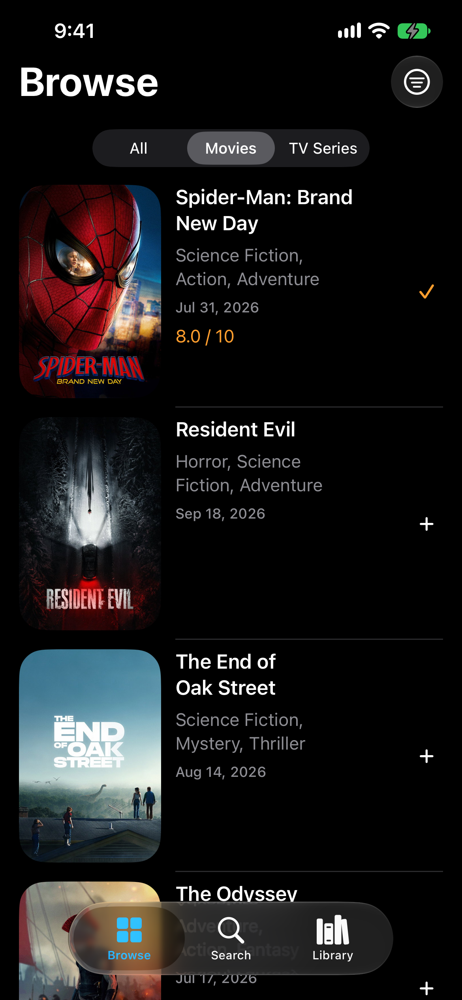
  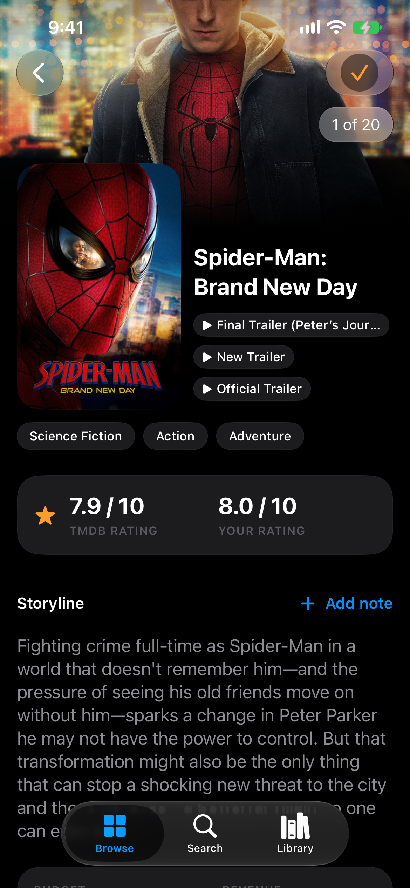
  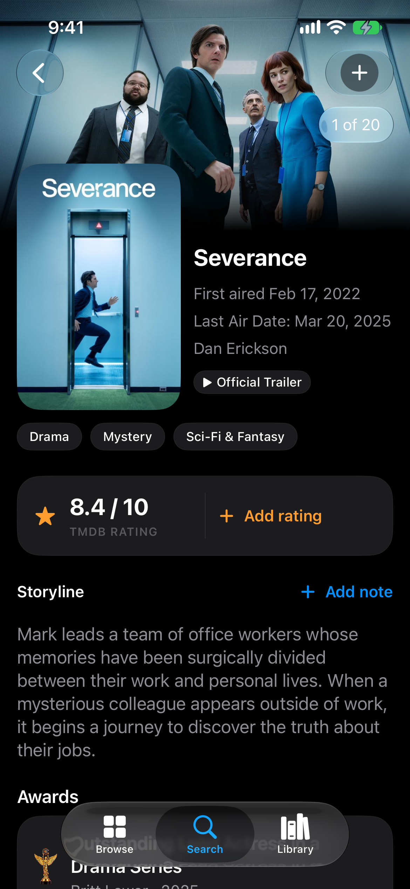

## Using it

Three tabs: **Browse**, **Search**, and **Library**. A row opens the title or the person. The button on the right adds it to a list.

### Browse

**All**, **Movies**, and **TV Series** sit under the title. **Filters** sets the window and the sort.

The window is **All**, **Now Playing**, or **Upcoming**. Sort is **Popular**, **Top Rated**, **Alphabetical**, **Newest**, or **Oldest**. Sort applies to the All window. Now Playing and Upcoming already have an order, so the sort rows are disabled there.

A row is a poster, the title, genres, the release or first-air date, your score when you have one, and the list button. Pull to refresh. The next page loads as you reach the end. A failed refresh keeps the list on screen.

  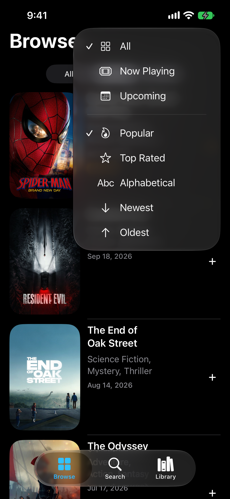
  

### Search

An empty field shows three shelves: **Oscar Winners**, **BAFTAs**, and **Emmys**. A shelf opens that ceremony’s categories. A category opens titles, newest ceremony year first, with a **Winners** / **Nominees** control. The year replaces the release date on those rows.

A query searches **Movies**, **TV**, or **People**. The field keeps the query after you open a result, and dismissing the keyboard leaves the results in place. A near-miss still ranks: typing Christopher Waltz finds Christoph Waltz. Matching is local, on the names TMDB already returned.

  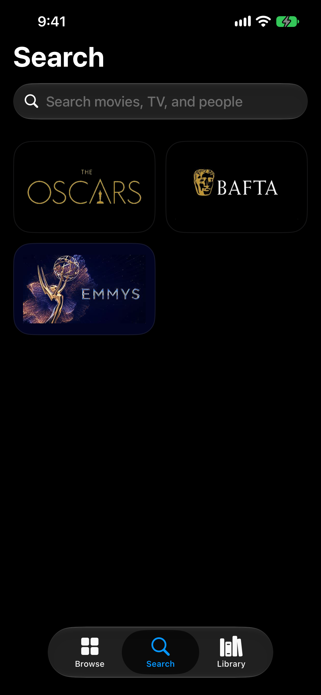
  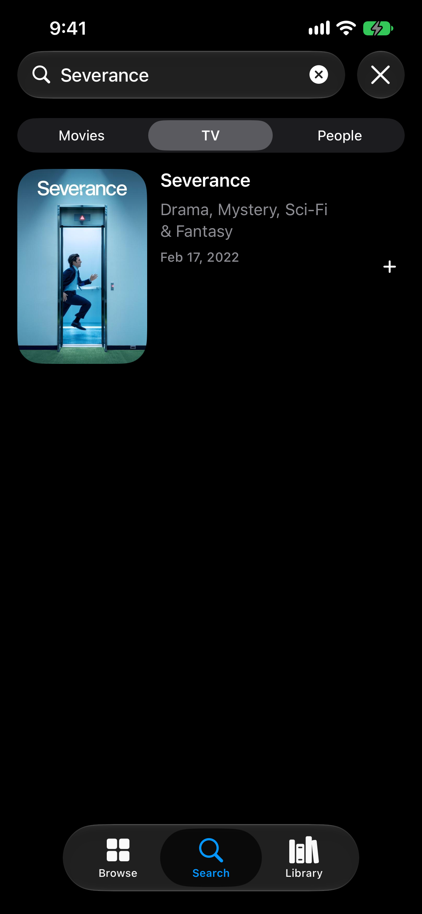
  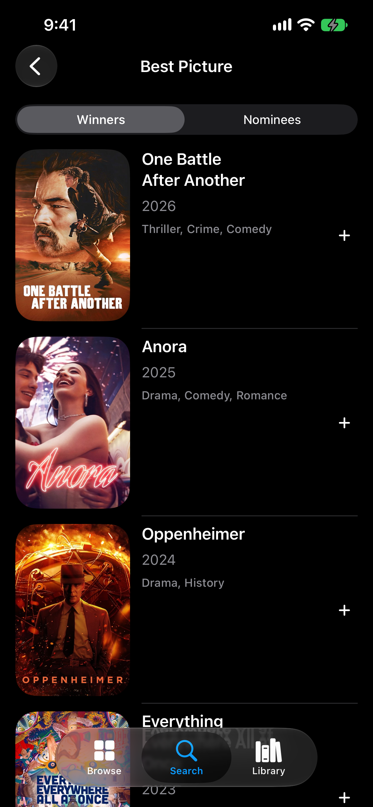

### A title

A movie or series opens on a full-bleed backdrop. The poster, trailers, and genre pills sit on the first screen. The rating card shows the TMDB score and **your** score, in half points from 0.5 to 10. Saving a score puts the title on **Watched**. The storyline and **Add note** share one block: a saved note can replace the storyline, and you can switch back. Facts (budget, revenue, air dates) come next, then prizes for that title.

The same page shape is used for a season and an episode. A series links to its seasons. A season links to its episodes. A collection on a movie opens the films in that collection. Posters and backdrops open full screen.

  
  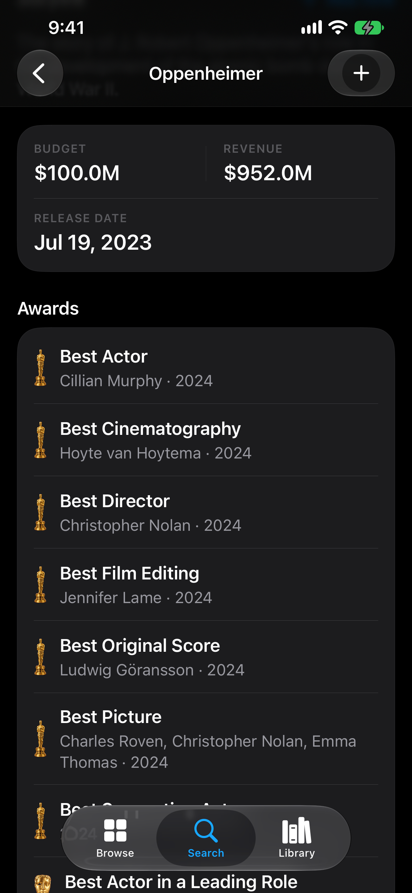

### People

A person page is the photo, the name, a link to their IMDb page, the biography, and the facts TMDB has (birthday, place of birth). Prizes given to that person use the same awards card as a title. Tapping a prize opens the film or episode when the catalog has an id. Credit carousels follow, with the work they are known for first. Acting, directing, and the other departments can open as a full list.

  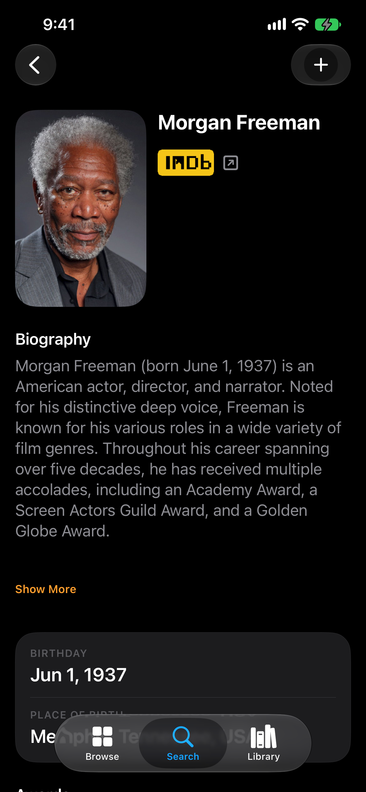
  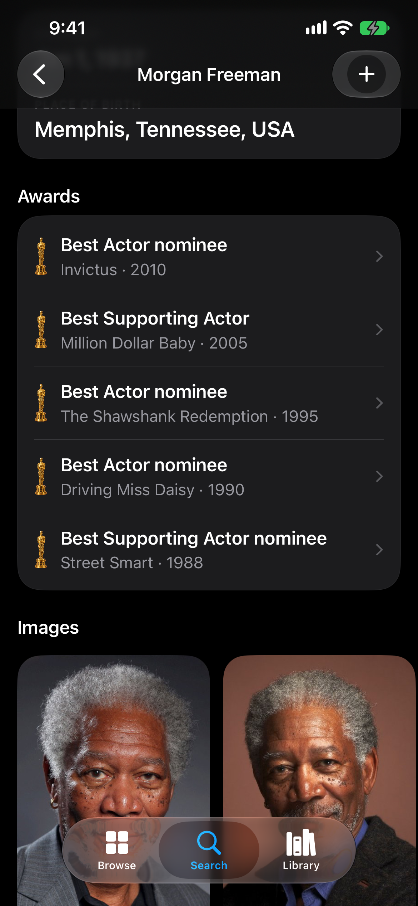

### Library

**Movies & TV** and **People** are separate libraries, so a person never lands on a title list. **Watched** and **Watchlist** live on Movies & TV. They cannot be renamed, deleted, or reordered. Any other list is one you create: rename, delete, reorder, and a cover made from up to four posters or profile photos.

The list button on a row is a menu of every list in that segment, plus **New list**. A check means the title is on that list. Adding something to Watched takes it off Watchlist. A banner confirms the change and offers **Undo**.

Watched and Watchlist can be sorted — Date Added, Alphabetical, Popular, Top Rated, Newest, Oldest — from the snapshot saved when you added the title, so the list does not need the network to reorder. Inside a list you can filter All / Movies / TV, or search the titles by name.

  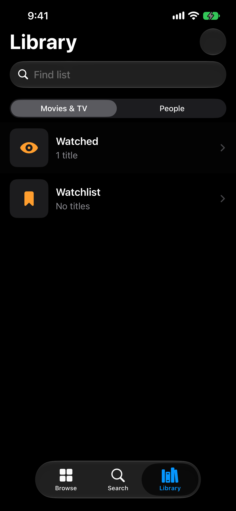
  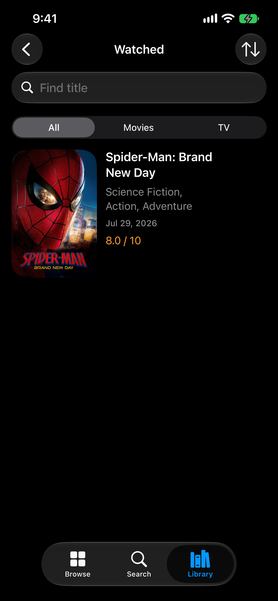

## How it’s built

SwiftUI, Swift 6 with strict concurrency, iOS 26. No third-party dependencies. The app target reads its version from [`Version.xcconfig`](Version.xcconfig).

Each layer only talks to the one below it:

`View` → `ViewModel` → `Repository` → TMDB, or the on-device store

Views render state and forward intent. View models are `@Observable` and `@MainActor`, and they import Foundation only. Repositories return domain models or throw `AppError`. DTOs stay in the data layer.

Dependencies are built once in the composition root and passed down. There is no `shared` singleton.

### One state enum

A screen has one `LoadState`: idle, loading, empty, loaded, or failed. Refresh, paging, and a failed refresh are a `LoadActivity` nested inside `.loaded`, so the list the user already has stays on screen. Empty is its own case, so a successful response with no rows cannot be drawn as a blank list. Parallel `isLoading` / `error` / `items` flags were rejected because they can disagree.

### Protocols only at the boundary

Three protocols: `HTTPClient`, the library store, and `AppLogging`. Repositories and view models are concrete. A second implementation did not exist, so a protocol per type would only have added a fake to maintain. Tests substitute the HTTP client and the disk store, then run the real repository and the real view model.

### Navigation

`AppRouter` owns the selected tab and one navigation path per tab. Views push a `Route`. They do not construct the next screen. A stored `favorites` tab value still opens Library, from when that tab had the old name.

### Browse is one list

Movies and series are two TMDB streams. Browse merges them as pages arrive, and only appends, so a row you have already seen does not jump when the next page comes in. Popular alternates movie and series. The other sorts compare a shared key. Upcoming series has no dedicated TMDB endpoint, so that window is a Discover query filtered on first air date. Now Playing and Upcoming are filters on this list rather than extra tabs, because the row, the media control, and paging are the same screen.

### Awards are a compiled catalog

TMDB has no awards API. The Academy has no public one either. [`scripts/build_awards_catalog.py`](scripts/build_awards_catalog.py) reads Wikidata, joins each credit to TMDB by IMDb id, and writes [`TheSilverScreen/Data/Resources/AwardsCatalog.json`](TheSilverScreen/Data/Resources/AwardsCatalog.json). A Monday job opens a pull request when the file changes. Nothing merges itself. The phone reads the bundled file, keeps a cached copy if it is newer, and at most once a week downloads the copy on `main`. A failed download leaves the current catalog up. The phone never calls Wikidata.

The tradeoff is freshness and coverage. The catalog can be a few days behind a ceremony, a category with fewer than eight resolved titles stays off the menu, and a credit with no TMDB id cannot be opened. In exchange, award screens do not depend on a live SPARQL query, and the same card can render on a phone with no network after the first launch. Details are in [`AWARDS.md`](AWARDS.md).

### Images

`ImageLoader` is the only image pipeline, injected from the composition root. Decoded images sit in `NSCache`. Encoded bytes sit in `URLCache`. In-flight requests for the same URL are coalesced. Decode downsamples to the size on screen, and the request asks TMDB for the nearest size (`w92` through `w500`) instead of always fetching `w500`. A poster that fails or is missing keeps its layout and shows a placeholder.

### What stays on the device

Lists and annotations are JSON files in Application Support, owned by their repositories. A list row copies the poster path, genres, date, and popularity at add time. That is why Watched can sort offline, and why a date on a list can lag a later correction from TMDB.

The TMDB key is not in source. Copy [`Secrets.example.xcconfig`](Secrets.example.xcconfig) to `Secrets.xcconfig` (gitignored) and set `TMDB_API_KEY`. A missing key fails at launch with instructions, instead of a 401 that looks like a decoding bug. Requests still send that key as TMDB’s v3 `api_key` query item. A v4 bearer token would keep the key out of the URL, which is the better shape, and the logging rules already refuse to print request URLs. I kept the v3 key so the app can run with the credential TMDB issues without a separate token.

### Tests and the agent harness

Unit tests live under `TheSilverScreenTests/`, split the same way as the app. They cover repositories, view models, list rules, search ranking, and the awards catalog.

The repo also carries the harness used to build it: architecture and style rules in [`.cursor/rules/`](.cursor/rules/), the agent contract in [`AGENTS.md`](AGENTS.md), and CI checks that reject an empty test and a pull request that skips the template. Hooks refuse a new third-party dependency. That harness is how the app stayed consistent as the surface grew. It is not a runtime dependency.

## Run it

- A Mac with **Xcode 26** or newer.
- A free TMDB API key from [themoviedb.org](https://www.themoviedb.org/settings/api).
- `cp Secrets.example.xcconfig Secrets.xcconfig`, then set `TMDB_API_KEY`.
- Open `TheSilverScreen.xcodeproj` and run the **TheSilverScreen** scheme.

A Debug run is named **Silver Dev** (`com.collinbrowse.thesilverscreen.dev`) and does not advance the build number. The shipping name is **Silver Screen**. Versioning and TestFlight are in [`RELEASE.md`](RELEASE.md).

## Where to look

| Path | What it is |
| --- | --- |
| `TheSilverScreen/App/` | Composition root, `AppDelegate`, `SceneDelegate` |
| `TheSilverScreen/Screens/` | One folder per feature: the screen, its view model, and extracted subviews |
| `TheSilverScreen/Design/` | Spacing, type, color, posters, the rating card, the note block |
| `TheSilverScreen/Navigation/` | Tabs, routes, and the path per tab |
| `TheSilverScreen/Data/Domain/` | Models the rest of the app is allowed to see |
| `TheSilverScreen/Data/Repositories/` | Mapping, paging, lists, annotations, awards |
| `TheSilverScreen/Data/Networking/` | The HTTP client and TMDB requests |
| `TheSilverScreen/Support/` | `AppError`, `LoadState`, logging, `ImageLoader` |
| `TheSilverScreenTests/` | Unit tests |
| [`AWARDS.md`](AWARDS.md) | How the awards catalog is built and refreshed |

## Data sources

This product uses the TMDB API but is not endorsed or certified by TMDB. Person pages link out to IMDb. Award credits are compiled from Wikidata and joined to TMDB by IMDb id.
